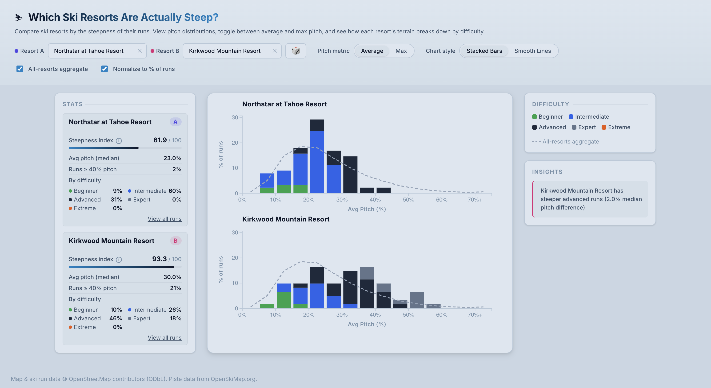

# [Which Ski Resorts are Actually Steep?](https://ski-resort-steepness.matthewhsu.me)

Ski resort difficulty ratings are useful, but they are not standardized across mountains. A "black diamond" at one resort can feel very different at another because ratings are often scaled to local terrain. That makes cross-resort comparisons difficult, especially when planning trips or trying to understand how steep terrain really is across regions.

This project provides a more objective comparison of resort steepness across North America using public [OpenSkiMap](https://openskimap.org) data. Instead of relying only on resort-assigned labels, it ranks resorts (and runs) with measurable terrain metrics: **average pitch**, **max pitch**, and **run length**. The app combines interactive charts, ranking views, and side-by-side resort comparisons so you can quickly explore how steepness profiles differ between mountains.

[](https://ski-resort-steepness.matthewhsu.me)

## Disclaimer

These rankings are provided for informational use only and are not a definitive measure of skiing difficulty, safety, or risk. They reflect terrain steepness metrics from public data, but real-world difficulty depends heavily on current conditions, including snow quality, grooming, moguls, visibility, weather, and marked or unmarked obstacles. Data quality and map coverage can vary by resort. Do not use this project to make travel, route, or safety decisions.

## Quickstart

1. First, install dependencies. This project uses python to transform OpenSkiMap data.

   ```bash
   python3 -m venv venv
   source venv/bin/activate
   pip install -r requirements.txt
   ```

2. Run the data pipeline to automatically download and refresh data.

   ```bash
   source venv/bin/activate
   python src/data_pipeline/run_pipeline.py
   ```

3. Run the app locally, and open `http://localhost:8765/src/visualization/index.html` to preview the visualization.
   ```bash
   python3 -m http.server 8765
   ```

## Data pipeline

The pipeline outputs files used directly by the app:

- `data/resorts/*.json` (per-resort run data)
- `data/aggregate_stats.json` (global aggregate stats)

### Re-run full pipeline

```bash
source venv/bin/activate
python src/data_pipeline/run_pipeline.py
```

### Re-run without downloading fresh source CSVs

```bash
source venv/bin/activate
python src/data_pipeline/run_pipeline.py --skip-download
```

### Run steps individually

```bash
source venv/bin/activate
python src/data_pipeline/download_resort_data.py
python src/data_pipeline/filter_ski_areas.py -o data/filtered_ski_areas.csv
python src/data_pipeline/run_csv_to_json.py -o data/resorts
python src/data_pipeline/compute_aggregate_stats.py
```

## Build for static hosting

```bash
npm install
npm run build:viz
```

This writes a minified `dist/` with app assets and data.

## Contributing

Issues and PRs are welcome. If you change pipeline logic or resort data, please rerun the pipeline and confirm the visualization still loads locally.
