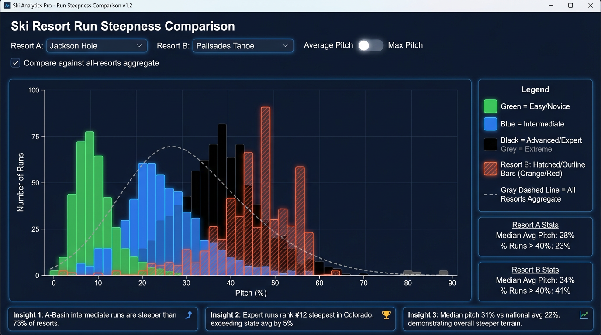

# Plan 02: Initial Steepness Visualization

## Overview

Build a static D3.js single-page visualization (`src/visualization/index.html`) that lets users compare run steepness histograms between two ski resorts and against all-resort aggregate statistics.

## Mockup



The mockup shows the full intended layout: overlapping histograms with stacked difficulty-colored bars, an aggregate overlay line, a legend/stat panel, and insight cards.

## Data

- Source: `data/resorts/<resort_name>.json` (837 files, ~28k runs)
- Key fields: `average_pitch_%`, `max_pitch_%` (decimal ratios, e.g. 0.46 = 46%), `color` (green/blue/black/grey/orange), `difficulty`
- Pre-aggregated stats (median, percentiles by difficulty) computed once at load time from all resort files or from a pre-baked `data/aggregate_stats.json`

## Architecture

```
src/visualization/
  index.html          ← single file, loads D3 + data
  style.css           ← dark navy theme
  app.js              ← D3 chart logic

data/
  resorts/            ← existing per-resort JSON (loaded on demand)
  aggregate_stats.json ← pre-baked: pitch distribution + percentile breakdowns by difficulty

src/data_pipeline/
  compute_aggregate_stats.py  ← new script, reads all resort JSONs, outputs aggregate_stats.json
```

## Main Histogram Chart

- **X-axis**: pitch in % (multiply stored ratio × 100), bins of ~5%
- **Y-axis**: run count (or optionally normalized to % of resort's runs)
- **Resort A bars**: stacked by `color` field (green → blue → black → grey → orange), using actual OSM difficulty colors
- **Resort B bars**: same stacking but rendered semi-transparent (opacity ~0.5) overlaid on Resort A
- **Aggregate overlay**: a KDE/smoothed density curve (or step line) from `aggregate_stats.json`, scaled to resort count
- D3 `d3.bin()` for binning; `d3.stack()` for stacked bars

## Controls

- Two `<select>` dropdowns (searchable via `<datalist>`) populated from the list of 837 resort files
- Toggle: Average Pitch / Max Pitch
- Checkbox: Show all-resorts aggregate overlay
- Checkbox: Normalize y-axis to % of runs (instead of count)

## Side Panel

- Per-resort stat cards: median pitch, % runs above 40%, run count by difficulty
- Insight cards (bottom row): auto-generated text using percentile lookups from `aggregate_stats.json`, e.g. "Intermediate runs at [Resort A] are steeper than X% of US resorts"

## Additional Visualization Ideas

Beyond the core histogram, here are strong candidates to add later:

1. **Box plot / strip plot by difficulty** — One row per difficulty level, x = pitch. Shows median + IQR per resort side-by-side. Great for "are A-Basin blacks steeper than Vail blacks?"
2. **Percentile rank radar chart** — Pentagon/hexagon axes: avg pitch, max pitch, % expert terrain, vertical drop, run count, % gladed. Each resort is a polygon. Good for holistic resort profile comparison.
3. **Scatter: avg pitch vs. max pitch** — Each dot = one run, colored by difficulty. Shows which resorts have consistent vs. variable steepness. Hover for run name.
4. **Difficulty-stratified CDF** — Cumulative distribution curves (one per difficulty color) for each resort. Easy to see "90% of blue runs are below X% pitch." Two resorts on same axes.
5. **Steepness heatmap** — Resorts on Y, pitch buckets on X, cell = number of runs. Sort resorts by median pitch. Gives a global overview of all 837 resorts at once.

## Implementation Notes

- Use `fetch()` + `Promise.all()` to load resort JSONs lazily (only load selected resorts)
- `aggregate_stats.json` structure: `{ "by_difficulty": { "green": { "p10": ..., "p50": ..., "p90": ... }, ... }, "overall_histogram": [{ "bin_start": 0, "bin_end": 5, "count": 123 }, ...] }`
- D3 v7 via CDN (`d3js.org/d3.v7.min.js`)
- No build step — pure static files, openable with `open index.html` or any local server

## Implementation Tasks

- [x] `src/data_pipeline/compute_aggregate_stats.py` — pre-bake `data/aggregate_stats.json` (pitch histograms + percentile breakdowns by difficulty across all resorts)
- [x] `src/visualization/index.html` — controls (resort dropdowns, pitch toggle, aggregate toggle), chart container, legend, stat panel
- [x] `src/visualization/style.css` — dark navy theme, axis styles, difficulty color palette
- [x] `src/visualization/app.js` — D3 v7: resort loading, `d3.bin()`, stacked bars, aggregate overlay curve, tooltips, insight card generation

## How to run

From the repo root, serve the project (e.g. `python3 -m http.server 8765`), then open `http://localhost:8765/src/visualization/index.html`. The app loads `data/aggregate_stats.json` and resort JSONs from `data/resorts/` using paths relative to the page. Regenerate aggregate stats after updating resort data: `./venv/bin/python src/data_pipeline/compute_aggregate_stats.py`.
