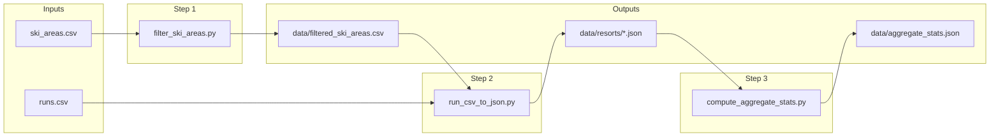

# Ski Areas Data Pipeline

## Current state

- [run_csv_to_json.py](src/data_pipeline/run_csv_to_json.py) reads `runs.csv`, filters to United States only and downhill, groups by `ski_area_names`, writes one JSON per resort under `data/resorts/`. It does not use `ski_areas.csv`.
- [compute_aggregate_stats.py](src/data_pipeline/compute_aggregate_stats.py) globs `data/resorts/*.json` and writes `data/aggregate_stats.json` (no CLI args).
- Runs are linked to areas via `ski_area_names` and `ski_area_ids`; [ski_areas.csv](ski_areas.csv) has `name` and `id` (same id format as `runs.ski_area_ids`).

---

## 1. New script: filter_ski_areas.py

**File:** `src/data_pipeline/filter_ski_areas.py`

**Input:** `ski_areas.csv` (path via CLI, default `ski_areas.csv`).

**Output:** `data/filtered_ski_areas.csv` (same columns as input; only filtered rows). Create `data/` if needed.

**Preprocessing (all required):**

- `countries` in `('United States', 'Canada', 'Mexico')`
- `status == 'operating'`
- `has_downhill == 'yes'`
- `name` non-empty (after strip)
- **Numerics:** Drop rows where any of these are missing or invalid (empty / non-numeric): `vertical_m`, `lift_count`, `downhill_distance_km`. Then apply thresholds:
  - `vertical_m >= 50`
  - `lift_count >= 1`
  - `downhill_distance_km > 0`

**CLI:** Optional positional `csv_path` (default `ski_areas.csv`); optional `-o` / `--output` for output path (default `data/filtered_ski_areas.csv`). Print how many rows kept.

---

## 2. Extend run_csv_to_json.py: require --ski-areas

**File:** [src/data_pipeline/run_csv_to_json.py](src/data_pipeline/run_csv_to_json.py)

- **`--ski-areas PATH`** is **required**. Do not support running without it (no backward compatibility).
- Load the CSV at PATH and collect the set of `id` values (column `id`).
- Filter runs to:
  - `countries` in `('United States', 'Canada', 'Mexico')`
  - `uses == 'downhill'`
  - `ski_area_ids` in the allowed set. If a run has multiple ids in one cell (e.g. comma-separated), split and keep the run if any id is in the set.
- Require non-empty `ski_area_names`; drop geometry; group by `ski_area_names`; skip groups with ≤1 run; write one JSON per resort under `--output-dir` (filename = sanitized resort name).

**Malformed run filters (apply to runs after the filters above):**

- Drop runs where `average_pitch_%` or `max_pitch_%` is missing or non-numeric.
- Drop runs where `name` is empty or whitespace-only.
- **Include** runs where `average_pitch_%` or `max_pitch_%` is greater than 1 (do not drop them; pitch may be stored as ratio > 1 or as percentage).
- Drop runs where `difficulty` is `freeride`.

---

## 3. Pipeline script: run_pipeline.py

**File:** `src/data_pipeline/run_pipeline.py`

Single entry point that runs, in order:

1. **Filter:** Run filter script on `ski_areas.csv` → write `data/filtered_ski_areas.csv`.
2. **Runs to JSON:** Run `run_csv_to_json` with `runs.csv` and `--ski-areas data/filtered_ski_areas.csv`, output to `data/resorts` (default).
3. **Aggregate stats:** Run `compute_aggregate_stats` (no args).

**Implementation:** Use `subprocess` and `sys.executable` so the pipeline works with the project venv when invoked from repo root (e.g. `./venv/bin/python src/data_pipeline/run_pipeline.py`). Paths relative to CWD (repo root).

**Optional CLI:** `--ski-areas-csv`, `--runs-csv` to override input paths; defaults `ski_areas.csv`, `runs.csv`.

---

## 4. compute_aggregate_stats.py

No code changes. It already reads all `data/resorts/*.json` and writes `data/aggregate_stats.json`. The pipeline simply invokes it after step 2.

---

## Data flow



---

## Usage (after implementation)

From repo root with venv activated:

```bash
# Full pipeline
./venv/bin/python src/data_pipeline/run_pipeline.py
```

Run steps manually:

```bash
./venv/bin/python src/data_pipeline/filter_ski_areas.py ski_areas.csv -o data/filtered_ski_areas.csv
./venv/bin/python src/data_pipeline/run_csv_to_json.py runs.csv --ski-areas data/filtered_ski_areas.csv -o data/resorts
./venv/bin/python src/data_pipeline/compute_aggregate_stats.py
```

---

## Edge cases

- **Missing numerics in filter:** Drop the row if `vertical_m`, `lift_count`, or `downhill_distance_km` is missing or not parseable.
- **ski_area_ids in runs:** If a run has multiple ids (e.g. comma-separated), split and keep the run if any id is in the allowed set.
