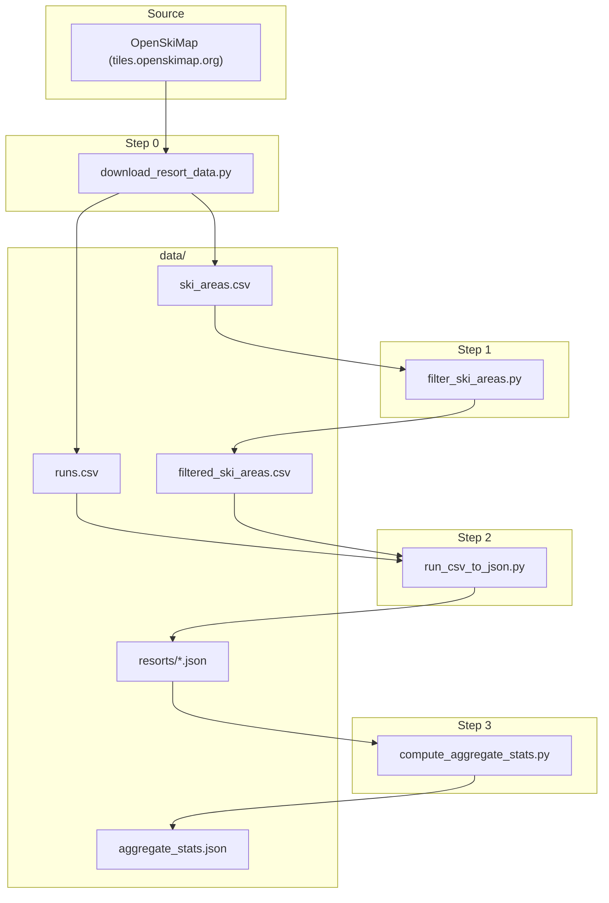

# Data pipeline

This directory holds the ski-areas data pipeline: it downloads OpenSkiMap CSVs, filters to North American downhill resorts, exports per-resort run JSON, and precomputes aggregate pitch statistics for the visualization.

## Data flow

All inputs and outputs live under the repo **`data/`** directory. Run all commands from the **repo root** with the project venv activated (or use `./venv/bin/python`).



| Step | Script | Inputs | Outputs |
|------|--------|--------|---------|
| 0 | `download_resort_data.py` | — (downloads from web) | `data/ski_areas.csv`, `data/runs.csv` |
| 1 | `filter_ski_areas.py` | `data/ski_areas.csv` | `data/filtered_ski_areas.csv` |
| 2 | `run_csv_to_json.py` | `data/runs.csv`, `data/filtered_ski_areas.csv` | `data/resorts/*.json` |
| 3 | `compute_aggregate_stats.py` | `data/resorts/*.json` | `data/aggregate_stats.json` |

## How to run

From the repo root:

```bash
# Full pipeline (download + filter + runs-to-JSON + aggregate)
./venv/bin/python src/data_pipeline/run_pipeline.py
```

If you already have the CSVs in `data/` and want to skip the download:

```bash
./venv/bin/python src/data_pipeline/run_pipeline.py --skip-download
```

Override input paths (e.g. to use different CSVs):

```bash
./venv/bin/python src/data_pipeline/run_pipeline.py \
  --ski-areas-csv data/ski_areas.csv \
  --runs-csv data/runs.csv
```

### Running steps individually

Useful for debugging or re-running only part of the pipeline:

```bash
# Step 0: download only
./venv/bin/python src/data_pipeline/download_resort_data.py

# Step 1: filter ski areas (default input: data/ski_areas.csv)
./venv/bin/python src/data_pipeline/filter_ski_areas.py -o data/filtered_ski_areas.csv

# Step 2: runs to JSON (defaults: data/runs.csv, data/filtered_ski_areas.csv)
./venv/bin/python src/data_pipeline/run_csv_to_json.py -o data/resorts

# Step 3: aggregate stats (reads data/resorts/*.json, writes data/aggregate_stats.json)
./venv/bin/python src/data_pipeline/compute_aggregate_stats.py
```

## Script reference

- **`download_resort_data.py`** — Fetches `ski_areas.csv` and `runs.csv` from OpenSkiMap. Options: `--ski-areas-out`, `--runs-out` (defaults: `data/ski_areas.csv`, `data/runs.csv`).
- **`filter_ski_areas.py`** — Keeps North America (US, Canada, Mexico), operating, downhill areas with valid `vertical_m`, `lift_count`, `downhill_distance_km` and minimum thresholds. Positional input path (default `data/ski_areas.csv`), `-o` for output (default `data/filtered_ski_areas.csv`).
- **`run_csv_to_json.py`** — Filters runs to allowed ski areas, drops malformed rows, groups by resort; writes one JSON file per resort with more than one run. Input: runs CSV (default `data/runs.csv`), `--ski-areas` (default `data/filtered_ski_areas.csv`), `-o` output dir (default `data/resorts`).
- **`compute_aggregate_stats.py`** — Reads all `data/resorts/*.json`, computes pitch histograms and per-difficulty percentiles, writes `data/aggregate_stats.json`. No CLI args; paths are relative to repo root.
- **`run_pipeline.py`** — Runs steps 0–3 in order. Options: `--ski-areas-csv`, `--runs-csv`, `--skip-download`.

## Dependencies

- Python 3 with the project venv (see repo root `requirements.txt`: pandas).
